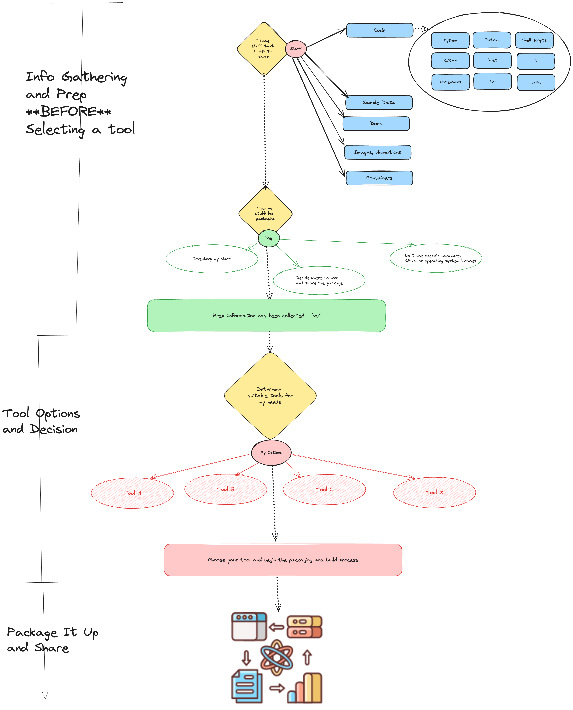

# pragmatic-packaging
A user focused approach to packaging 

## Motivation

As a basic user, I wish to do task abc successfully. 
As an advanced Python and C++/Fortran user, I wish to do xyz successfully. The user's pathway to success will be different: process steps and secondarily tool selection.

In general, I believe over-emphasis on the tools has made all of the packaging tutorials and discussions for years less than ideal for a user.
Perhaps coming at the problem from the specific outcome desired and the associated processes would be more productive and much easier to keep up to date.

## Beliefs and Constraints

Personally, I believe that "one" tool is unable to solve each user's needs.
Instead, multiple tools have evolved to satisfy the individual user's use case.
Changes in Python and its uses have driven the need for more than one packaging tool.

Instead of focusing on "one" tool to rule them all, I believe that users seek the tool that helps them accomplish their specific task.
As a user with a specific task, I may be faced with several tools that meet my needs. I now need to choose among these tools.
Alternatively, I may only have one tool that somewhat meets my needs and I need to improvise or create a custom solution.

## Open Source to Enterprise

Difference ecosystems will gravitate to different tools and have various motivations, beyond technical, for doing so.
This is not necessarily a bad thing as it pushes the envelope for innovation.
However, the tools from these ecosystems do create friction and conflicting views.
A pragmatic approach is "Seek first to understand the use case and needs.
Second, accept that there will be orthogonal.

## An Opinionated View of a User's Packaging Decision Process (High Level)

